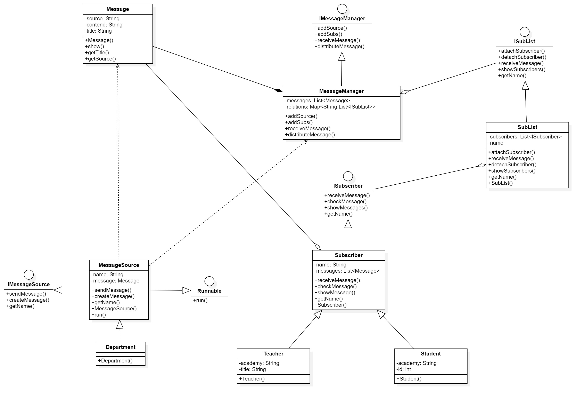

# 订阅/发送风格的事件管理系统

## 文件说明

`src`中存储着源码文件，运行Client.java即可启动。

报告、设计类图等在`doc`文件夹下。

## 使用说明

具体指令说明请参考“指令系统”部分。

1. 首先，需要创建多个部门和多个订阅者（老师或者学生）。
2. 然后，将老师/学生添加到订阅名单中。
3. 将订阅名单注册到部门，表示部门会向订阅名单中的订阅者发送消息。（一个部门可注册多个订阅名单，一个订阅名单可注册多个部门，允许订阅者在同一部门的不同名单中重复）
4. 模拟场景：部门发送消息。注册完毕后无需指定接收者，消息管理器会自动完成部门与订阅者之间的解耦以及消息的正确分发。
5. 可以选择订阅者查看自己收到的消息。

## 整体架构v2.0

* 采用发布/订阅风格
* 同时支持同步/异步操作（同步操作为v1.0版本，在Client中调用runExample()可查看示例）



## 指令系统

请使用空格分隔！
[]内部允许除了[]之外的任何字符

* 创建类指令
  * 创建部门：create dep [部门名]
  * 创建学生：create stu [学生名]
  * 创建老师：create tea [教师名]
  * 创建订阅者名单：create subs [订阅者名单名]
* 添加类指令
  * 向订阅者名单中添加订阅者：add [订阅者名单] [订阅者] 
* 注册类指令
  * 在部门中注册订阅者名单：register [部门] [订阅者名单]
* 展示类指令
  * 展示订阅者名单中的所有订阅者：show subs [订阅者名单]
  * 展示订阅者的所有消息：show submes [订阅者]
* 查看类指令
  * 订阅者查看序号为i的消息：check [订阅者] [消息序号]
* 发送类指令
  * 部门发送消息：send [部门] [消息标题] [消息内容]				

## 使用示例

请输入以下指令进行测试：

```command
// 创建各订阅者
create tea [Master Lee]
create tea [Doctor Wang]
create stu [Jack]
create stu [Jane]
create stu [Mary]
create stu [Lucy]

// 创建部门
create dep [CS]
create dep [TC]
create dep [AO]

// 创建部门对应的订阅者名单
create subs [CS_List]
add [CS_List] [Master Lee]
add [CS_List] [Jack]
add [CS_List] [Mary]

create subs [TC_List]
add [TC_List] [Doctor Wang]
add [TC_List] [Jane]
add [TC_List] [Lucy]

// 向部门订阅
register [CS] [CS_List]
register [TC] [TC_List]

//教务处AO比较特别，其消息会发送给所有人，所以都要订阅
register [AO] [CS_List]
register [AO] [TC_List]

//开始模拟场景
//CS学院发送通知
send [CS] [ICPC Registration] [Requirements: Strong programming skills and teamwork abilities. Interested students, please register in Room 501 of the Science Building on October 8, 2024!]

//TC学院发送通知
send [TC] [National Day Celebration] [Our college will hold a National Day gala on the evening of October 1 at 19:00. Stay tuned!]

//教务处发送通知
send [AO] [Course Selection System Failure] [We apologize for the issues with our course selection system, which is experiencing network delays again. Students and faculty encountering problems should contact the Academic Affairs Office as soon as possible!]

// 接收到消息后，订阅者开始查看
//Lee老师查看自己的消息列表并选择消息查看
show submes [Master Lee]
check [Master Lee] 1

//Wang老师查看自己的消息列表并选择消息查看
show submes [Doctor Wang]
check [Doctor Wang] 2

//Jack同学查看自己的消息列表并选择消息查看
show submes [Jack]
check [Jack] 1
Check [Jack] 2
```

纯指令版本

``````Command
create tea [Master Lee]
create tea [Doctor Wang]
create stu [Jack]
create stu [Jane]
create stu [Mary]
create stu [Lucy]
create dep [CS]
create dep [TC]
create dep [AO]
create subs [CS_List]
add [CS_List] [Master Lee]
add [CS_List] [Jack]
add [CS_List] [Mary]
create subs [TC_List]
add [TC_List] [Doctor Wang]
add [TC_List] [Jane]
add [TC_List] [Lucy]
register [CS] [CS_List]
register [TC] [TC_List]
register [AO] [CS_List]
register [AO] [TC_List]

send [CS] [ICPC Registration] [Requirements: Strong programming skills and teamwork abilities. Interested students, please register in Room 501 of the Science Building on October 8, 2024!]
send [TC] [National Day Celebration] [Our college will hold a National Day gala on the evening of October 1 at 19:00. Stay tuned!]
send [AO] [Course Selection System Failure] [We apologize for the issues with our course selection system, which is experiencing network delays again. Students and faculty encountering problems should contact the Academic Affairs Office as soon as possible!]

show submes [Master Lee]
check [Master Lee] 1

show submes [Doctor Wang]
check [Doctor Wang] 2

show submes [Jack]
check [Jack] 1
check [Jack] 2

``````


